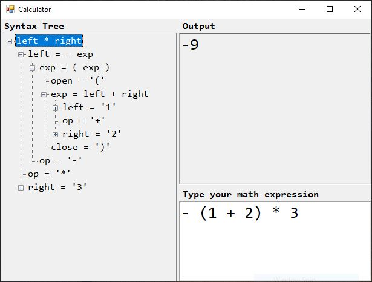

# Calculator, handy recursive descent parser in C#

BNF Grammar used in the project:

    exp -> exp "+" term
         | exp "-" term
         | term

    term -> term "*" factor
         | term "/" factor
         | factor

    factor -> "+" factor
         | "-" factor
         | "(" exp ")"
         | number

    number -> [0-9]+ ([.][0-9]+)? ([eE](+|-)?[0-9]+)

